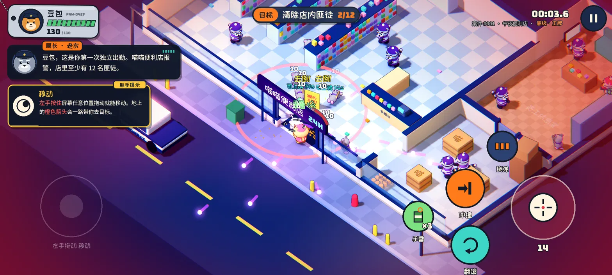
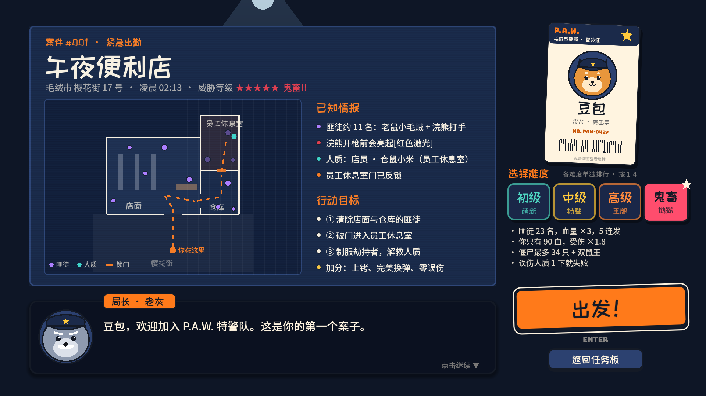

# 爪爪特警 · PAW S.W.A.T.

**猫咪出警，破门救人，火力全开！**

《爪爪特警》是一款用 Godot 制作的俯视角动作射击小游戏。玩家扮演猫咪特警，闯入便利店清剿劫匪、破门解救人质，拾取武器和道具，应对僵尸狂潮，最后击败鼠王完成任务。

有不同难度和通关排行榜，主打短时间内的爽快战斗、武器变身和救援体验。开发过程中使用了 AI 辅助，累计花费约 **100 美元**。

当前源码版本：**v0.12.2** · Godot **4.6.3** · 键鼠与触屏操作 · 自定义非商业源码许可



## 玩法介绍

你将加入 P.A.W. 特警队，在「午夜便利店」执行救援任务。游戏采用 45° 等距俯视视角，围绕短局战斗、武器切换和人质救援展开。

1. **突入便利店**：跟随地面橙色箭头，清除店面与仓库中的匪徒。浣熊开枪前会亮起红色激光，及时翻滚或利用柜台、箱子掩护。
2. **破门救人**：冲撞或互动打开员工休息室的锁门，抓住子弹时间制服劫持者，再解救人质，让人质撤离到警车。
3. **迎战僵尸潮**：拾取空投神器和补给，在 60 秒的僵尸狂潮中坚持战斗；还须消灭当前难度要求的鼠王，才能完成任务。
4. **挑战更快通关**：结算查看成绩，尝试完美换弹、减少误伤，并在不同难度下刷新通关记录。

**v0.12.2 的匪徒规则：击倒即永久制服，短暂消散后释放；无需上铐，也不会醒来。**

### 武器、变身与补给

- **神装武器**：喵喵散弹、罐头激光、肉垫火箭，以及空投神器「罐头加特林」。拾取神器时带有变身特写。
- **随时切换**：拾取的神装保存在本局武器库中；同种武器再次拾取可叠加弹药，耗尽后才消失。
- **完美换弹**：换弹进度进入黄色区域时，再按一次换弹键，获得 4 秒火力强化。
- **罐头手雷**：范围爆炸，最多携带 3 颗；神装与手雷不会伤害人质。
- **护盾与医疗补给**：僵尸潮提供临时护盾及限额医疗补给。护盾提供 5 秒无敌；医疗补给单件最多恢复 35 HP，不超过血量上限。

## 四档难度

每档难度有独立的通关排名，敌人数量、火力、玩家生存能力及人质误伤容错各不相同。



| 难度 | 匪徒数量 / 血量 | 玩家血量 / 受伤倍率 | 僵尸同时在场上限 / 鼠王数量 | 人质误伤失败阈值 |
| --- | --- | --- | --- | --- |
| 初级 · 萌新 | 9 名 / ×0.5 | 200 HP / ×0.4 | 8 只 / 1 只 | 5 次 |
| 中级 · 特警 | 11 名 / ×1 | 100 HP / ×1 | 16 只 / 1 只 | 3 次 |
| 高级 · 王牌 | 16 名 / ×1.7 | 130 HP / ×1.25 | 26 只 / 2 只 | 2 次 |
| 鬼畜 · 地狱 | 23 名 / ×3 | 90 HP / ×1.8 | 34 只 / 3 只 | 1 次 |

截图由作者提供，部分画面可能来自较早版本；当前规则与数值以 v0.12.2 源码为准。

## 操作方式

### 电脑键鼠

| 操作 | 按键 |
| --- | --- |
| 移动 | WASD / 方向键 |
| 瞄准 / 射击 | 鼠标移动 / 左键 |
| 精准瞄准 | 鼠标右键 |
| 翻滚躲弹 | 空格 / Shift |
| 换弹 / 完美换弹 | R；进入黄色区域时再按一次 |
| 冲撞 / 撞门 | Q |
| 互动破门 / 解救人质 | E / F |
| 切换武器 | Tab / X / 滚轮向下 |
| 投掷手雷 | G |
| 暂停 | Esc / P |

### 手机与平板

左侧按住拖动移动，右侧开火摇杆可锁定目标自动连射，也可拖动手动瞄准；点击敌人可切换锁定目标。屏幕按钮负责翻滚、冲撞、换弹、手雷、武器切换和互动。暂停菜单中可调整瞄准方式、声音及震动。

v0.12.2 修正了桌面 Edge 与混合触屏设备误进入手机布局的问题，可根据实际键鼠或触摸输入切换操作模式。

## 在 Godot 中运行

1. 安装 [Godot 4.6.3 标准版](https://godotengine.org/download/)（无需 .NET）。这是随包文档记录的验证与导出版本。
2. 下载本仓库，或执行：

   ```bash
   git clone https://github.com/namjeesung/paw-swat.git
   ```

3. 打开 Godot，选择「导入」，载入 `GodotProject/project.godot`。
4. 等待首次资源导入完成，按 **F5** 运行。

可在命令行中预览触屏布局：

```bash
godot --path GodotProject -- --touch
```

仓库提供可编辑源码、Web/Android 导出预设和开发文档。自行导出需安装相应 Godot 导出模板；Android 还需配置 SDK 和自己的签名。**本次 GitHub 上传未新增可执行安装包，也未部署网页或排行榜服务器。**

## 通关排行榜

- **本机记录**：按难度保存通关成绩。
- **Toy 公共榜**：Web 版本集成了 B 站 Toy 排行榜接口，需在真实 Toy 平台中运行。直接在本地运行或复制网页文件，不等于公共榜已启用。
- **独立服务器榜**：仓库保留可选的 Cloudflare Workers / D1 排行榜服务源码；自行部署后，在 `GodotProject/leaderboard.cfg` 填写服务地址。默认地址为空。

v0.12.2 改变了匪徒制服规则，旧版本成绩仍可能保留，因此跨版本通关用时不属于完全相同规则下的比较。Toy 公共榜的真实双账号验收尚未完成，详见[排行榜协议与验证边界](docs/v0.12.1/TOY-RANKING.md)。

## 源码结构

```text
GodotProject/                 Godot 工程
  project.godot               项目入口配置
  scenes/                     场景
  scripts/actors/             玩家、匪徒、人质与子弹
  scripts/world/              关卡流程、场景与相机
  scripts/ui/                 任务板、简报、HUD、排行榜与结算
  scripts/autoload/           全局状态、声音与联网
  assets/                     字体与声音资源
  shaders/                    视觉效果
  web/                        网页输入与 Toy 接口桥接
server/leaderboard/           可选独立排行榜服务
docs/                        开发记录、验证报告与截图
LICENSE                      自定义非商业源码许可
THIRD_PARTY_NOTICES.md        第三方组件与字体许可说明
```

## 版本与开发记录

当前版修复和已有验证记录见 [v0.12.2 说明](docs/v0.12.2/EDGE-AND-DESPAWN.md)。随包报告包含逻辑、输入回归及打包验证；不代表本次上传进行了真实 Edge、WebGL、手机 GPU 或听音验收。`docs/v0.11` 等历史文档仅供开发参考。

## 许可与商业授权

Copyright © 2026 **[namjeesung](https://github.com/namjeesung)**。

本项目采用[自定义非商业源码许可](LICENSE)：

- 非商业用途可免费使用、修改和再分发，须保留作者署名、版权声明及许可，并标明修改。
- 售卖、广告变现、内购、付费服务及其他商业用途，必须事先获得 **namjeesung 的书面授权**。
- 第三方代码和素材继续遵守各自原许可，不纳入本项目的重新授权；详见[第三方许可说明](THIRD_PARTY_NOTICES.md)。

这是一份自定义非商业源码许可；正式商业授权前建议进行法律审阅。商业授权请通过作者 GitHub 主页所列联系方式联系。

公开后他人可以保留副本；即使之后将仓库改为私有，既有 fork 或本地副本仍会存在。参见 [GitHub 许可说明](https://docs.github.com/en/repositories/managing-your-repositorys-settings-and-features/customizing-your-repository/licensing-a-repository)。
